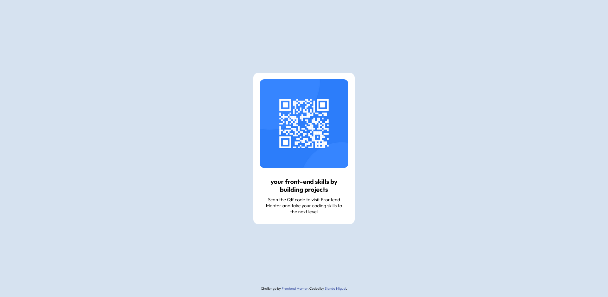

# Frontend Mentor - QR code component solution

This is a solution to the [QR code component challenge on Frontend Mentor](https://www.frontendmentor.io/challenges/qr-code-component-iux_sIO_H/hub/card-qr-code-component-O1Vacr66Ew). Frontend Mentor challenges help you improve your coding skills by building realistic projects. 

## Table of contents

- [Overview](#overview)
  - [Screenshot](#screenshot)
  - [Links](#links)
- [My process](#my-process)
  - [Built with](#built-with)
  - [What I learned](#what-i-learned)
- [Author](#author)

## Overview

### Screenshot



### Links

- Solution URL: [Add solution URL here](https://www.frontendmentor.io/challenges/qr-code-component-iux_sIO_H/hub/card-qr-code-component-O1Vacr66Ew)
- Live Site URL: [Add live site URL here](https://siendomiguel.github.io/QR-code-component/)

## My process

### Built with

- Semantic HTML5 markup
- CSS custom properties
- Flexbox
- Mobile-first workflow

### What I learned

In this challenge I have been able to learn a couple of things, mostly with the issue of containing an image inside a div or container. And pay attention to the code, I had a typo and that was giving me problems.

#### Contain an image inside a div.
```css
.qr-img {
  display: flex; /*ayuda a trabajar mejor con las imagenes si el contenedor padre tiene flexbox*/
  max-width: 325px;
  overflow: hidden; /*Esto es para recortar la imagen con base en este contenedor padre en caso de ser necesario*/
}

.qr-img img {
  width: 100%;
  height: auto;
  object-fit: cover; /*contiene la imagen*/
  border-radius: 15px;
  margin-bottom: 20px;
}

/*The typing error was when calling the qr-img class, it was missing the dot at the beginning*/
```
#### Also the use of position: absolute, which allows to position an element anywhere in the view.
```css
.attribution { 
  background-color: var(--Light-gray);
  font-size: 11px; text-align: center;
  position: absolute; /*define la alineación del elemento desde los margenes de la pagina, tambien se pueden colocar elementos uno encima del otro (se puede utilizar para popups) */
  bottom: 0; /*Definimos el elemento al final de la pagina*/
  margin-bottom: 20px;
}
```

## Author

- Frontend Mentor - [@siendomiguel](https://www.frontendmentor.io/profile/siendomiguel)
- Twitter - [@siendomigueldev](https://www.twitter.com/siendomigueldev)
