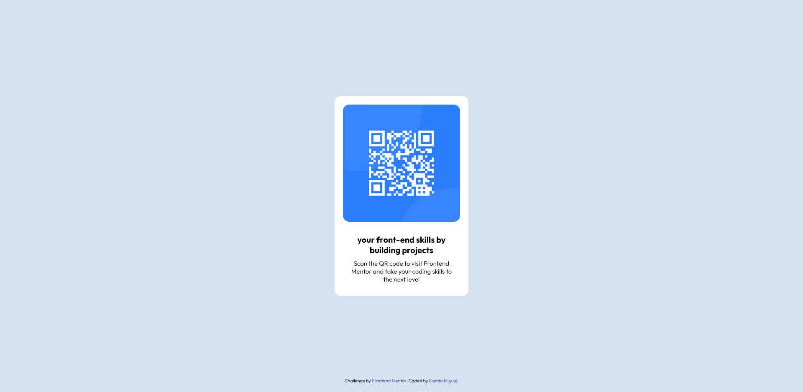

# Frontend Mentor - QR code component


## Welcome! 👋

Thanks for checking out this front-end coding challenge.

[Frontend Mentor](https://www.frontendmentor.io) challenges help you improve your coding skills by building realistic projects.

**To do this challenge, you need a basic understanding of HTML and CSS.**

## The challenge

Your challenge is to build out this QR code component and get it looking as close to the design as possible.

You can use any tools you like to help you complete the challenge. So if you've got something you'd like to practice, feel free to give it a go.

Want some support on the challenge? [Join our Slack community](https://www.frontendmentor.io/slack) and ask questions in the **#help** channel.

# Frontend Mentor - QR code component solution

This is a solution to the [QR code component challenge on Frontend Mentor](https://www.frontendmentor.io/challenges/qr-code-component-iux_sIO_H/hub/card-qr-code-component-O1Vacr66Ew). Frontend Mentor challenges help you improve your coding skills by building realistic projects. 

## Table of contents

- [Overview](#overview)
  - [Screenshot](#screenshot)
  - [Links](#links)
- [My process](#my-process)
  - [Built with](#built-with)
  - [What I learned](#what-i-learned)
- [Author](#author)

## Overview

### Screenshot



### Links

- Solution URL: [Add solution URL here](https://www.frontendmentor.io/challenges/qr-code-component-iux_sIO_H/hub/card-qr-code-component-O1Vacr66Ew)
- Live Site URL: [Add live site URL here](https://siendomiguel.github.io/QR-code-component/)

## My process

### Built with

- Semantic HTML5 markup
- CSS custom properties
- Flexbox
- Mobile-first workflow

### What I learned

In this challenge I have been able to learn a couple of things, mostly with the issue of containing an image inside a div or container. And pay attention to the code, I had a typo and that was giving me problems.

#### Contain an image inside a div.
```css
.qr-img {
  display: flex; /*ayuda a trabajar mejor con las imagenes si el contenedor padre tiene flexbox*/
  max-width: 325px;
  overflow: hidden; /*Esto es para recortar la imagen con base en este contenedor padre en caso de ser necesario*/
}

.qr-img img {
  width: 100%;
  height: auto;
  object-fit: cover; /*contiene la imagen*/
  border-radius: 15px;
  margin-bottom: 20px;
}

/*The typing error was when calling the qr-img class, it was missing the dot at the beginning*/
```
#### Also the use of position: absolute, which allows to position an element anywhere in the view.
```css
.attribution { 
  background-color: var(--Light-gray);
  font-size: 11px; text-align: center;
  position: absolute; /*define la alineación del elemento desde los margenes de la pagina, tambien se pueden colocar elementos uno encima del otro (se puede utilizar para popups) */
  bottom: 0; /*Definimos el elemento al final de la pagina*/
  margin-bottom: 20px;
}
```

## Author

- Frontend Mentor - [@siendomiguel](https://www.frontendmentor.io/profile/siendomiguel)
- Twitter - [@siendomigueldev](https://www.twitter.com/siendomigueldev)